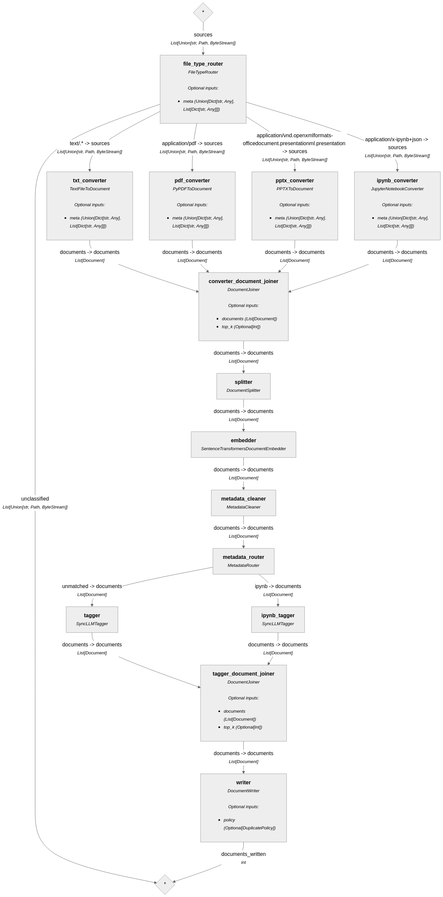
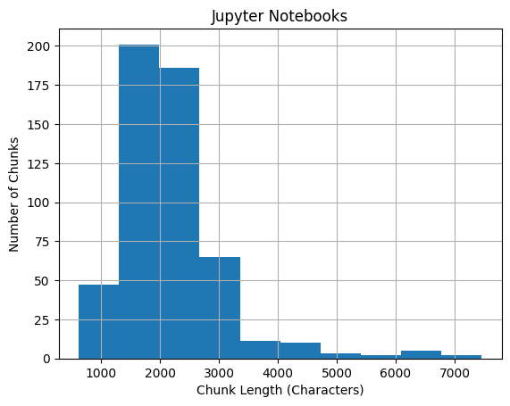
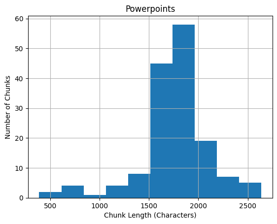

# <u>Future work</u>

Jupyter notebooks and powerpoints are the main file types tested. Converting and tagging PDF, HTML, Markdown need to be tested.

# <u>Vector database collection creation</u>

See `haystack_utilities.tools.milvus_utils.create_collection` for code.

**_<u>Schema</u>_**
|Field Name|Field Type|Notes|
|----------|----------|-----|
|`id`|`VARCHAR(64)`|`id` is a 64-character string. It is generated by the Haystack pipeline using SHA-256 (see `haystack.Document._create_id`).|
|`vector`|`FLOAT_VECTOR(768)`|768-dimension vector for `sentence-transformers/all-mpnet-base-v2` embedder. `vector` is the only indexed field.|
|`text`|`VARCHAR(65535)`|Text chunk. Length is configurable (see Lambda deployment and pipeline splitting for sample chunk length histograms).|
|`metadata`|`JSON`|See below|

`metadata` keys:
* `tags`: list of `str` tags
* `source_id`: 64-character `str` that represents the original file (generated by Haystack pipeline)
* `title`: file name
* `file_type`: file extension, e.g. `.pdf`
* `page_number`: file page number that the text chunk is from
* `split_overlap_ids`: `id`s of the other chunks that overlap this chunk

**_<u>Index</u>_**
```python
index_params.add_index(
    field_name="vector",
    metric_type="COSINE", # sentence-transformers/all-mpnet-base-v2 embeddings are L2-normalized
    index_type="AUTOINDEX", # Recommended by Zilliz
    index_name="vector",
)
```

Consistency level is set to `"Strong"` to ensure that database searches use the latest available data. See https://docs.zilliz.com/docs/consistency-level.

max chunk len - talk about splitting the notebooks and pptx


# <u>Indexing+tagging pipeline</u>

## <u>_Diagram_</u>



## <u>_File conversion_</u>

The pipeline starts by converting files to Haystack `Documents`. The pipeline routes to different converters based on MIME type:
|MIME type|Converter|Notes|
|---------|---------|-----|
|`text/.*`|Haystack's `TextFileToDocument`|This routes text files, HTML, Markdown, VTT. Haystack has `MarkdownToDocument` and `HTMLToDocument` converters, but we haven't evaluated these.|
|`application/pdf`|Haystack's `PyPDFToDocument`|Uses `pypdf` library|
|`application/vnd.openxmlformats-officedocument.presentationml.presentation`|Haystack's `PPTXToDocument`|Uses `python-pptx` library|
|`application/x-ipynb+json`|Custom `JupyterNotebookConverter`|Converts notebook (JSON format) to Markdown|

**Important note:** Video transcripts are generally not a good format for this application. There is a lot of noise/filler/useless information in transcripts, and even the useful information is not very useful without the video.

## <u>_Cleaning (Optional)_</u>

Cleaning (Haystack's `DocumentCleaner`) is optional. It strips extra whitespaces and newlines, which can cause the text to lose structure. This makes it difficult to read the text and may be detrimental to generation in the RAG pipeline.

## <u>_Splitting_</u>

`splitter` supports fixed and recursive chunking via Haystack's `DocumentSplitter` and `RecursiveDocumentSplitter`. Pass the splitting options as a dictionary.

Mainly tested fixed chunking because the recursive splitter returned incorrect splitting metadata (split overlap, source ID, page number).

Default splitting options:
```python
# sentence-transformers/all-mpnet-base-v2
# Max tokens = 384
# Roughly 288 words (3 words = 4 tokens)
splitting_options = {
    "split_strategy": "fixed",
    "split_by": "word",
    "split_length": 250,
    "split_overlap": 50,
    "split_threshold": 30,
    "respect_sentence_boundary": True
}
```

```python
# Example options for recursive chunking
splitting_options = {
    "split_strategy": "recursive",
    "split_length": 100,
    "split_overlap": 20,
    "split_unit": "word",
    "separators": ["\f", "\n\n", "sentence", "\n", " "]
}
```

### **<u>Sample chunk length histograms</u>**





## <u>_Metadata normalization_</u>

`metadata_cleaner` normalizes metadata after splitting. Its main purpose is to move all metadata into a dictionary under the key `"metadata"` to prepare for insertion into the vector database. The pipeline was not able to insert into the vector database without this change.

## <u>_Embedding_</u>

`embedder` uses default options. The model is `sentence-transformers/all-mpnet-base-v2` with a max input length of 384 tokens and an embedding dimension of 768.

## <u>_Tagging_</u>

After embedding, the pipeline routes to two branches based on file type. Each branch has its own tagger. `ipynb_tagger` is for tagging Jupyter notebooks, while `tagger` is for all other file types. The reason is because the LLM tagger performs better for Jupyter notebooks when you tell it that the text chunk is from a Jupyter notebook that has been converted to Markdown. Did not test this for other file types.

|Prompt|Recall|Precision|F1|
-------|------|---------|------|
|Did not specify that the chunk is from a Jupyter notebook|88.5%|77.1%|82.4%|
|Specified that the chunk is from a Jupyter notebook|92%|76.5%|83.5%|

The tagger returns a list of tags for each chunk. The tagger can return an empty list if none of the tags apply. For each file, tags are counted, and tags that appear > X% of the time are kept (X defaults to 30). Every tagged chunk (chunks with non-empty tag lists) is then tagged with all tags that meet the X% criterion. This "tag averaging" reduces noise.

Untagged chunks (chunks with empty tag lists) can be handled in one of three ways. This is a configurable option.
1. Keep untagged chunks and leave them untagged (for debugging). This is the default option.
2. Discard untagged chunks (because they don't contain much information)
3. Keep and tag the untagged chunks

# <u>Deploying the Lambda function</u>

Required environment variables:
* `OPENAI_API_KEY`
* `ZILLIZ_CLUSTER_ENDPOINT`
* `ZILLIZ_CLUSTER_TOKEN`
* `COLLECTION_NAME`: Collection name to store the indexed chunks. If the collection does not exist yet, then the collection will be created.

Optional environment variables:
* `SPLITTING_OPTIONS`: JSON string representing a dictionary of options for the pipeline `splitter`. If not set, then use default splitting options (see below).
* `SKIP_CLEANER`: Set to `true` to skip the pipeline `cleaner`. Defaults to `true`.
* `ADD_TAGGER`: Set to `true` to include `metadata_router`, `tagger`, `ipynb_tagger`, and `tagger_document_joiner` to the pipeline. Defaults to `true`.
* `MAX_CHUNK_LENGTH_IN_CHARS`: Set the max text length in the vector database collection schema. This is only used if the collection does not exist yet. Defaults to 65535 (the maximum supported by Zilliz). See pipeline splitting for sample chunk length histograms.

```python
# Default splitting options
splitting_options = {
    "split_strategy": "fixed",
    "split_by": "word",
    "split_length": 250,
    "split_overlap": 50,
    "split_threshold": 30,
    "respect_sentence_boundary": True
}
```
## <u>_Lambda function implementation notes_</u>

On cold start,
* Embedder files are cached to `/tmp/`
* Collection is created if it doesn't already exist
* S3 resource is initialized

`lambda_handler`
* Gets the bucket name and key (file name)
* If the MIME type of the key is not a supported MIME type, an `Exception` is raised
* Downloads the file to `/tmp/`
* Creates and runs the pipeline
* Deletes the file from `/tmp/`
* Returns the pipeline results (which is just the number of chunks inserted to the database)

**Important note:** The pipeline is created in `lambda_handler` because it may require a keep-alive directive to maintain the OpenAI and Zilliz connections. If the connections can be guaranteed to not be purged by Lambda, then the pipeline can be created outside of `lambda_handler`. See https://docs.aws.amazon.com/lambda/latest/dg/best-practices.html.

# <u>Notebooks</u>

Labeling, indexing, tagging, etc.